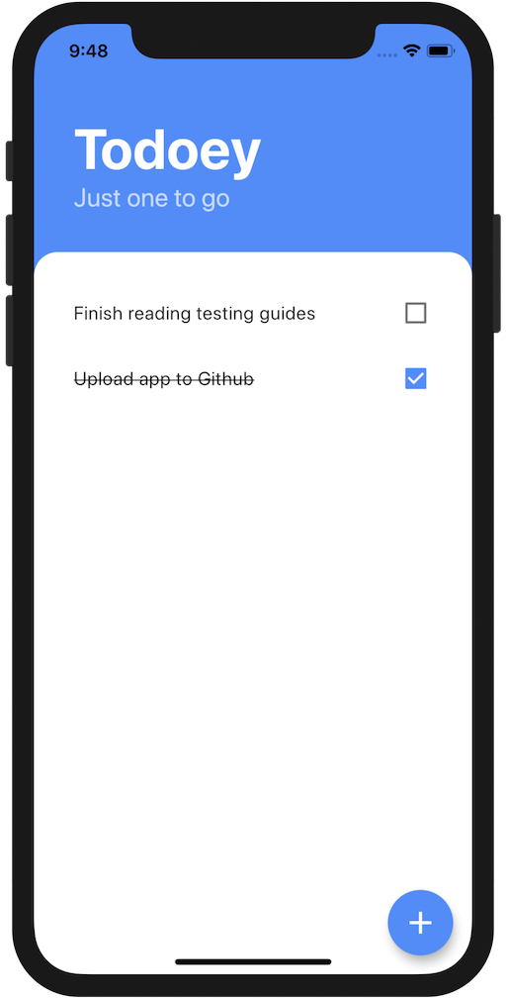

# Todoey 📝

A simple todo app developed to explore the basics of state management in Flutter. Based on the [Udemy Complete 2020 Flutter Development Bootcamp with Dart](https://www.udemy.com/course/flutter-bootcamp-with-dart/).

  

